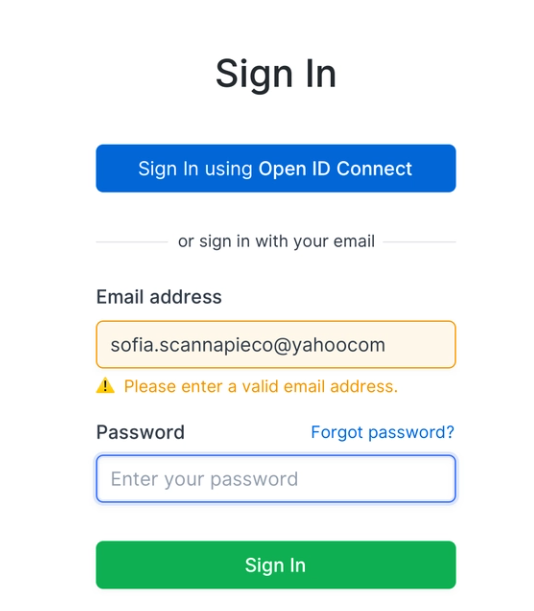
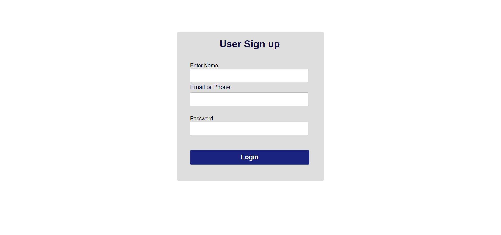
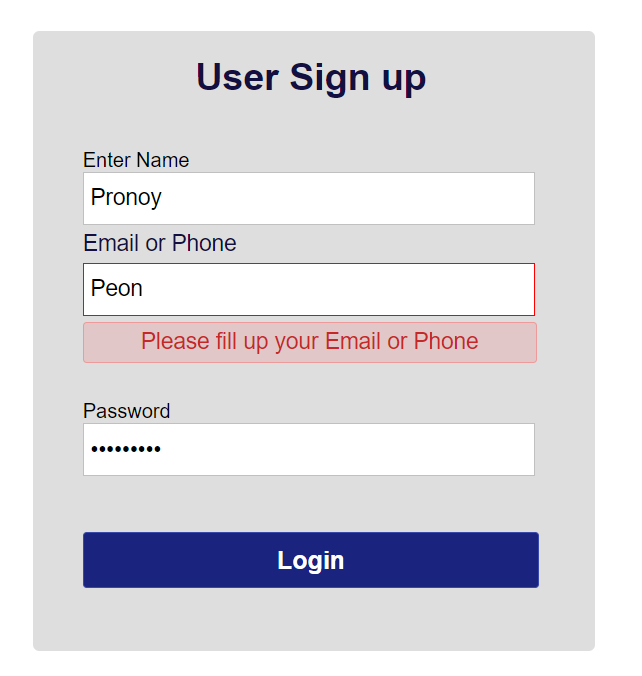

# Login & Signup Page

During the 4st week of Crework, we were asked to add validation and error handling to a Signup and Login Module via JavaScript.

## Reference Image

# My work👇

# Login Page

# Sign-Up Page

